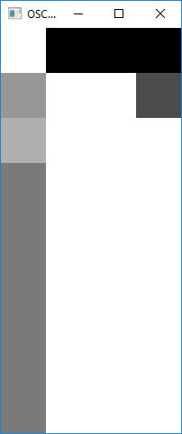
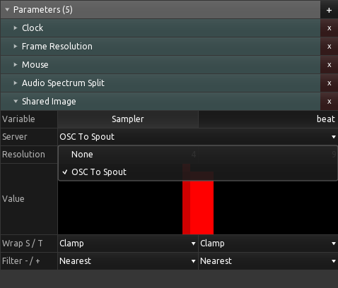

OSC To Spout
============

This is a very tiny tool to map OSC ([Open Sound Control](https://fr.wikipedia.org/wiki/Open_Sound_Control)) messages to a GPU texture and share them with [Spout](http://spout.zeal.co/). This might sound totally useless but is actually the most efficient way I found to get OSC messages into [KodeLife](https://hexler.net/products/kodelife), and I needed this to feed beat data from [Cooldown](https://github.com/eliemichel/Cooldown) when doing some live-coding of visuals. Kodelife can read the Spout-shared texture using its Shared-image feature:

**NB** This is a Windows-specific tool, since Spout is a Windows-specific library. For OSX, you can consider using Syphon.

Building
--------

This is a regular [OpenFrameworks](https://openframeworks.cc/) project, so you need to install OpenFrameworks, then run the [projectGenerator](https://openframeworks.cc/learning/01_basics/how_to_add_addon_to_project/) to configure the solution with your installation of OpenFramworks.

You need the addons ofxOsc (built-in) and [ofxSpout](https://github.com/elliotwoods/ofxSpout).

Customizing
-----------

This tool was made for my specific need, and everybody uses different OSC messages addresses, so you will need to customize them. Go to `src/ofAp.cpp` and tweak the `Settings` section to fit you needs, in particular change the `addr_to_index` dictionnary to map your OSC messages to the lines of the texture.

Limitations
-----------

The texture values are clamped within the range 0-1. This is very annoying to me, so if you find a work-around, please share it!

License
-------

The MIT License

Copyright (c) 2019 -- Élie Michel <elie.michel@exppad.com>

Permission is hereby granted, free of charge, to any person obtaining a copy
of this software and associated documentation files (the "Software"), to deal
in the Software without restriction, including without limitation the rights
to use, copy, modify, merge, publish, distribute, sublicense, and/or sell
copies of the Software, and to permit persons to whom the Software is
furnished to do so, subject to the following conditions:

The above copyright notice and this permission notice shall be included in
all copies or substantial portions of the Software.

THE SOFTWARE IS PROVIDED "AS IS", WITHOUT WARRANTY OF ANY KIND, EXPRESS OR
IMPLIED, INCLUDING BUT NOT LIMITED TO THE WARRANTIES OF MERCHANTABILITY,
FITNESS FOR A PARTICULAR PURPOSE AND NONINFRINGEMENT. IN NO EVENT SHALL THE
AUTHORS OR COPYRIGHT HOLDERS BE LIABLE FOR ANY CLAIM, DAMAGES OR OTHER
LIABILITY, WHETHER IN AN ACTION OF CONTRACT, TORT OR OTHERWISE, ARISING FROM,
OUT OF OR IN CONNECTION WITH THE SOFTWARE OR THE USE OR OTHER DEALINGS IN
THE SOFTWARE.
